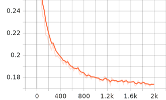

# Speech Conversion (Voice Conversion with SpeechT5)

> **Any‑to‑any voice conversion** powered by Microsoft’s SpeechT5 voice‑conversion model.  
> Convert a source utterance into the timbre of a target speaker using a short reference clip.

---

## Table of contents

- [Overview](#overview)
- [Features](#features)
- [How it works](#how-it-works)
- [Project structure](#project-structure)
- [Installation](#installation)
- [Quickstart (local inference)](#quickstart-local-inference)
- [Training (local)](#training-local)
- [Speaker embeddings (x‑vectors)](#speaker-embeddings-x-vectors)
- [AWS SageMaker (optional)](#aws-sagemaker-optional)
- [SageMaker endpoint: request/response](#sagemaker-endpoint-requestresponse)
- [Tips & troubleshooting](#tips--troubleshooting)
- [Ethics & responsible use](#ethics--responsible-use)

---

## Overview

This repository implements **voice conversion** (VC): given a source speech clip and a short **reference** clip of a target speaker, synthesize the source content in the **target’s voice**. The baseline uses the Hugging Face implementation of **SpeechT5** for VC and the matching **HiFiGAN** vocoder. A small training loop is provided for fine‑tuning on paired speakers (e.g., CMU ARCTIC).

---

## Features

- 🔁 **Any‑to‑any voice conversion** with a single reference utterance
- 🧩 Simple **local demo scripts** for quick experiments
- 🧪 **Training** pipeline for fine‑tuning VC on paired data
- ☁️ Optional **AWS SageMaker** training + hosted inference entry points
- 🎛️ Pluggable **speaker embeddings** (x‑vectors) with caching
- 🧰 Clean utilities for I/O, resampling, and batched inference

---

## How it works

1. Load SpeechT5 VC + processor and the matching HiFiGAN vocoder.
2. Extract a **speaker embedding** (x‑vector) from the **reference** WAV (mono, 16 kHz).
3. Feed the **source** mel features + target embedding into the model to generate acoustic features.
4. Use the vocoder to synthesize a time‑domain waveform and save a mono **16 kHz WAV**.

---

## Project structure

```
speech-conversion/
├── scripts/
│   ├── demo_local.py        # VCInference-based local demo
│   ├── convert_once.py      # Minimal one-off converter (HF API)
│   └── train.py             # Local training CLI (invoked by sagemaker/train.py)
├── speecht5_vc/
│   ├── __init__.py
│   ├── config.py            # Training/eval config helpers
│   ├── data.py              # Dataset assembly (e.g., CMU ARCTIC speaker pairs)
│   ├── embeddings.py        # Speaker x-vector embedder builder (SpeechBrain)
│   ├── inference.py         # VCInference wrapper (load/convert utilities)
│   ├── prepare.py           # Precompute/cache embeddings, split data, etc.
│   └── trainer.py           # Fine-tuning loop/utilities
└── sagemaker/
    ├── demo_lunch.py        # End-to-end: train → deploy → invoke
    ├── inference.py         # SageMaker model_fn/input_fn/predict_fn/output_fn
    ├── requirements.txt     # Runtime deps for hosted inference
    └── train.py             # SageMaker entrypoint (delegates to scripts/train.py)

```
> Note: exact filenames may evolve; see inline docstrings/`-h` help of each script for the latest options.

---

## Installation

> Tested with Python 3.10+

```bash
python -m venv .venv
# Linux/Mac:
source .venv/bin/activate
# Windows (PowerShell):
# .\.venv\Scripts\activate

pip install --upgrade pip

# Core deps
pip install "transformers>=4.42" "datasets>=2.20" "torch>=2.1" \
            "numpy>=1.24" "sentencepiece>=0.1.99" "protobuf>=4.23" \
            "speechbrain>=1.0.0" soundfile

# Optional (for AWS workflows)
# pip install sagemaker
```

**System packages**
- You may need system `libsndfile` for `soundfile` on some OSes.

---

## Quickstart (local inference)

Two common ways to run a one‑shot conversion.

### 1) Convenience wrapper

```bash
python scripts/demo_local.py \
  --checkpoint microsoft/speecht5_vc \
  --src path/to/src.wav \
  --ref path/to/ref.wav \
  --out converted.wav
```

### 2) Minimal driver

```bash
python scripts/convert_once.py \
  --checkpoint microsoft/speecht5_vc \
  --src path/to/src.wav \
  --ref path/to/ref.wav \
  --out converted.wav
```

**Notes**
- Input WAVs must be **mono 16 kHz**. Resample if needed:
  ```bash
  ffmpeg -i input.wav -ar 16000 -ac 1 output.wav
  ```
- You can replace `--checkpoint` with a **fine‑tuned** checkpoint directory produced by training.

---

## Training (local)

Example fine‑tuning run on paired speakers (e.g., CMU ARCTIC):

```bash
python scripts/train.py \
  --dataset_name cmu_arctic \
  --src_spk awb \
  --tgt_spk clb \
  --val_ratio 0.05 \
  --max_train_pairs 200 \
  --use_precomputed_xvectors True \
  --xvector_mode average \
  --per_device_train_batch_size 2 \
  --per_device_eval_batch_size 1 \
  --grad_accum 4 \
  --lr 1e-5 \
  --warmup_steps 50 \
  --max_steps 500 \
  --eval_every 100 \
  --save_every 250 \
  --seed 42 \
  --output_dir outputs/speecht5_vc_ft
```
**Download** the finetuned weights with bellow hyperparameter from [here](https://drive.google.com/file/d/1NgIDzFJCAoRBvPfJIQJD7P2PUpsXDhFX/view?usp=sharing)

## 🚀 Training Command

To reproduce the default training run:

```bash
python main.py \
  --dataset_name cmu_arctic \
  --src_spk awb \
  --tgt_spk clb \
  --val_ratio 0.05 \
  --xvector_mode average \
  --output_dir outputs/speecht5_vc_ft \
  --max_steps 2000 \
  --per_device_train_batch_size 2 \
  --per_device_eval_batch_size 1 \
  --grad_accum 8 \
  --lr 1e-5 \
  --warmup_steps 500 \
  --seed 42 \
  --save_every 1000 \
  --eval_every 1000
```
By default, the script uses the [CMU ARCTIC dataset](http://festvox.org/cmu_arctic/) with **AWB → CLB** as the voice conversion pair.
**Outputs**
- A standard Hugging Face model folder in `--output_dir` (config + weights + tokenizer files).
- Use this folder as `--checkpoint` in the local demos.


## 🖥️ Training Hardware & Environment

- **Device:** Laptop (Windows, WDDM driver model)  
- **GPU:** NVIDIA GeForce **RTX 3080 Ti Laptop GPU** (16 GB VRAM)  
- **Driver:** **576.52**  
- **CUDA (driver):** **12.9**  
- **PyTorch:** **2.8.0+cu129**  
- **CUDA available:** ✅  

---

## 📊 Training Logs & Metrics

- **Total FLOPs (training):** `1,571,716,275,216,842,800`  
- **Training runtime:** `1,688.2899` seconds  
- **Logging:** TensorBoard-compatible logs in `logs/training-logs/`  

You can monitor training live with:

```bash
tensorboard --logdir logs/training-logs
```

### 📉 Loss Curve

The following plot shows the training loss progression:



*(SVG file generated during training and stored under `assets/`)*


---

## Speaker embeddings (x‑vectors)

During inference, a **speaker x‑vector** is extracted from `--ref` audio and passed to SpeechT5.  
For training, you can precompute/cached x‑vectors to speed up epochs (see flags like `--use_precomputed_xvectors` and `--xvector_mode`).

---

## AWS SageMaker

The repo includes an **end‑to‑end** example to train, deploy, and invoke on AWS SageMaker:
```bash
python sagemaker/demo_lunch.py
```


What it does:

1. **Train** a job with the HuggingFace estimator (passing the same hyperparameters you’d use locally).
3. **Deploy** the resulting checkpoint to a real‑time endpoint using `HuggingFaceModel`.
5. **Invoke** the endpoint by posting JSON containing base64‑encoded WAVs.

The SageMaker **inference handler** lives at `sagemaker/inference.py` and implements `model_fn`, `input_fn`, `predict_fn`, `output_fn`. It loads the HF processor + model from the model artifact directory, the `HiFiGAN` vocoder, and the same speaker embedder used locally. Input is mono **16kHz**; output is returned as base64‑encoded WAV bytes.

---

## SageMaker endpoint: request/response

**Request (JSON)**
```json
{
  "src_wav_b64": "<base64 of mono 16 kHz WAV to convert>",
  "ref_wav_b64": "<base64 of mono 16 kHz WAV of target voice>"
}
```

**Response (JSON)**
```json
{
  "wav_b64": "<base64 of mono 16 kHz converted WAV>"
}
```

---

## Tips & troubleshooting

- **Audio format** → Always feed **mono 16 kHz WAV**.
- **Performance** → Use a GPU for real‑time or faster‑than‑real‑time conversion.
- **Checkpoints** → Any folder that `transformers.from_pretrained(...)` can load will work (base or fine‑tuned).
- **libsndfile** → If you get I/O errors, ensure `soundfile` and system `libsndfile` are installed.

---


